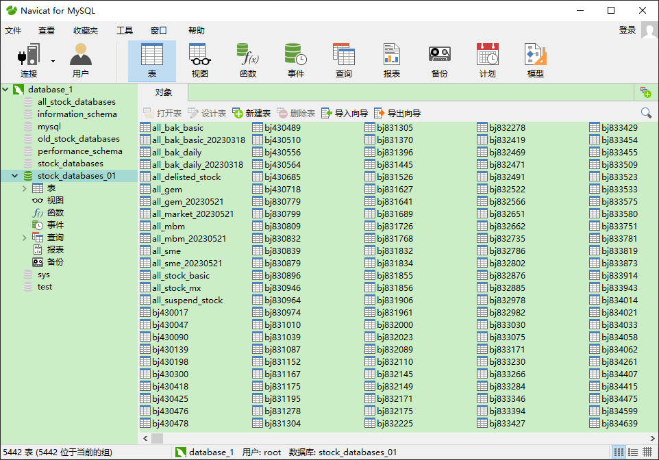
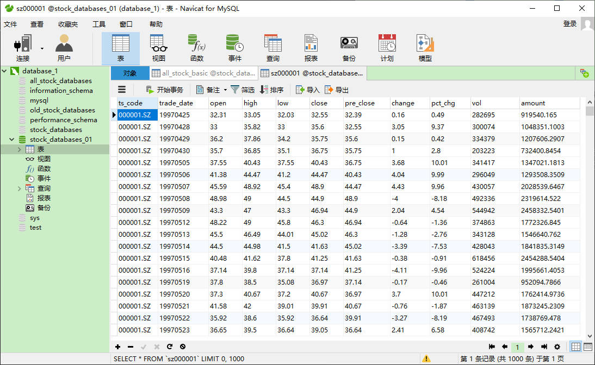
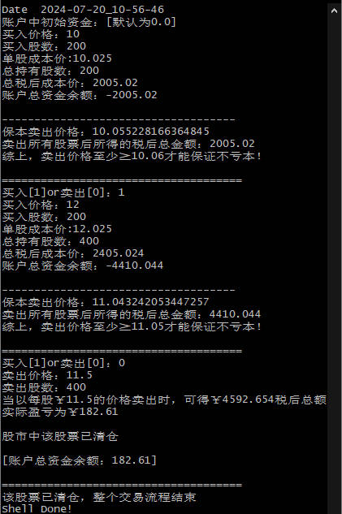

# A股行情数据获取&量化交易策略的结构设计

## A股日线行情
* 数据获取网址：<https://tushare.pro/> 
* 项目地址：<https://gitee.com/aiden_yang/Stocks> 

### 1.数据库搭建
* 使用Navicat for MySQL对数据库进行管理  
【数据库中的具体参数目前集成在mysql_stock*.py文件中，后续会修改进配置文件中】
  

### 2.A股日线行情数据获取
* 运行根目录下的**main.py**文件，调用**mysql_stock_01.py**文件进行数据采集及存储  
【目前该文件在存储数据到数据库时，会出现少存一天的日线行情数据的现象，原因在于其中的get_daily_stocks()函数逻辑存在Bug，已将write_data()存储到数据库的函数注释掉，后续会fix】

## 量化交易策略的基础结构【待续】

### 1.阿尔法模型
### 2.风险模型
### 3.交易成本模型
### 4.投资组合构建模型
### 5.执行模型

---
## 文件说明
* main.py # 主程序
    * mysql_stock_01.py（mysql_stock.py中多个接口由于受到积分权限的限制无法调用，如需使用可在Tushare上自行申请）
    
* mysql_data_processing.py   # 数据处理模块库
* tushare_api.py    # 需要传参的tushare的接口
* rules.py  # 辅助交易的小工具【可根据本金投入提示止盈止损】  

* API.txt   # 接口调用说明【待修改】

* sz000001.csv  # 从数据库导出的股票日线行情数据

---
