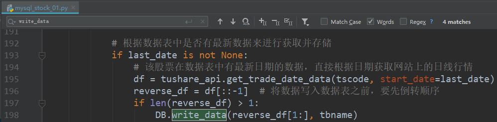
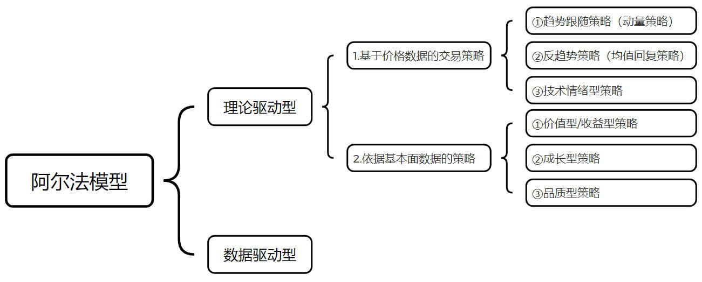
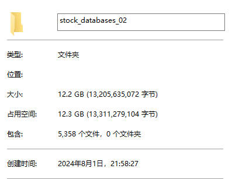
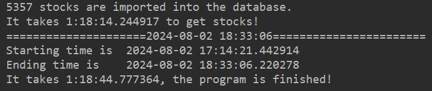
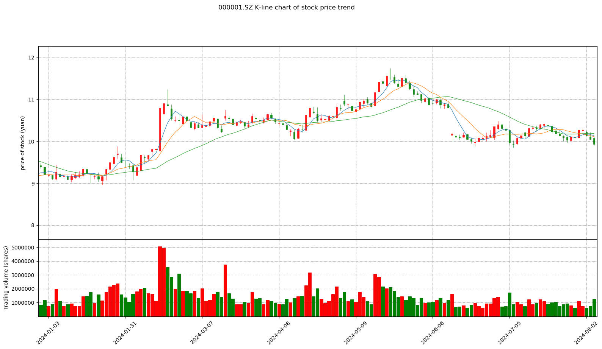
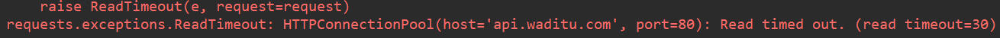

# A股行情数据获取&量化交易策略的结构设计

## A股日线行情
* 数据获取网址：<https://tushare.pro/> 
* 项目地址：<https://gitee.com/aiden_yang/Stocks> 

### 1.数据库搭建
* 使用Navicat for MySQL对数据库进行管理  
【数据库中的具体参数目前集成在mysql_stock*.py文件中，后续会修改进配置文件中】  
【20240807：目前mysql_stock*.py中的配置参数已经修改进[config-\__init\__.py]文件中】
  


### 2.A股日线行情数据获取
* 运行根目录下的**main.py**文件，调用**mysql_stock_01.py**文件进行数据采集及存储  
【目前该文件在存储数据到数据库时，可能会出现少存一天的日线行情数据的现象，原因在于其中的get_daily_stocks()函数逻辑存在Bug，已将write_data()存储到数据库的函数注释掉，后续会fix】  
【20240807：目前运行未出现该现象，若依然复现出该问题欢迎提Issue】  


## 量化交易策略的基础结构【持续更新】

### 1.阿尔法模型

### 2.风险模型
### 3.交易成本模型
### 4.投资组合构建模型
### 5.执行模型

---
## 文件说明（文件结构和ts接口调用见API.txt）
* [config]
    * \__init\__.py   # 配置文件
* [Module]
    * \__init\__.py   # 配置文件（暂空）
    * mysql_data_processing.py   # 数据处理模块 & 图像展示模块  
    * mysql_data_storage.py # 数据存储模块
    * MySQL_Database.py # 数据库操作模块
    * tushare_api.py    # 需要传参的tushare的接口
* [output]  # 训练日志存储（目前还没有增加自动打印运行日志，后续会加上）
    * "train_2024-08-06_20-28-00.log"该日志为第二次运行，故耗时为半小时左右，程序首次运行耗时约1.5~2.5h
* [Strategy]    # 量化交易回测框架模块
    * \__init\__.py # 量化交易策略参数配置
    * demo_strategy_csv.py  # 从csv文件获取数据的简单回测策略文件
    * demo_strategy_db.py  # 从数据库获取数据的简单回测策略文件
    * demo_strategy_db_sma.py  # 基于sma策略的简单回测策略文件
    * sz000001.csv  # 个股数据csv文件（和`demo_strategy_csv.py`文件配合使用）
* [web/img] # README.md所需图片
* main.py # 主程序
    * mysql_stock_01.py（mysql_stock.py中多个接口由于受到积分权限的限制无法调用，如需使用可在Tushare上自行申请）
* TOKEN_ID.py
``` python
# run main.py之前需要自行创建TOKEN_ID.py文件，且需自行注册并申请token id
TOKEN = 'https://tushare.pro/user/token进行申请'
```
* rules.py  # 辅助交易的小工具【可根据本金投入提示止盈止损】  

* API.txt   # 接口调用说明【修改于20240914】
* CHANGELOG.log   # 更新日志
* README.md # 快速开始文件
* requirements.txt  # 项目所需依赖包
* sz000001.csv  # 从数据库导出的股票日线行情数据

## 程序运行
0.自行准备运行环境并设置数据库，同时需要确保数据库所在磁盘空间大于20GB，目前A股5000+支股票的日线行情数据所需空间如图  
  
1.在[config]中的__init__.py配置文件中自行修改数据库名称
``` python
DATABASE = 'stock_databases'
STOCK_BASIC_ = 'L' 
```
2.运行*main.py*，程序跑完之后会提示运行结束


3.当数据全部存储到本地后，可以直接运行*mysql_data_processing.py*文件，来查看个股的K线图，如图展示“000001.SZ平安银行”的K线、MA及成交量


4.量化交易策略回测简单尝试（数据未复权）：[基于Python的量化交易回测框架Backtrader初识记录（一）](https://blog.csdn.net/u011628215/article/details/141750404)  


## Issues
1.如果运行中遇到连接超时（如图1），请重新再运行一次程序，原因是接口连接不稳定；通常第一次运行程序会出现，因为第一次耗时较长（一般1.5h~2.5h），后续运行一般在半小时以内
  

---
